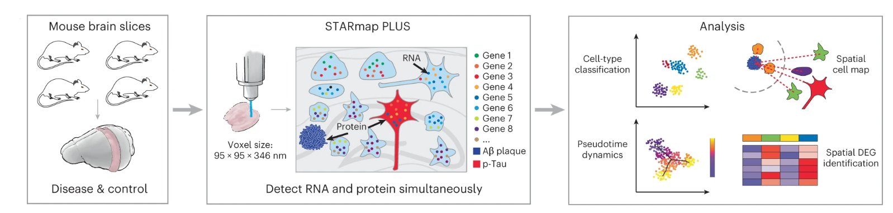

# STARmap PLUS-analysis

Scripts for the '**Integrative in situ mapping of single-cell transcriptional states and tissue histopathology in an Alzheimer disease model**'. 

### Other Info

#### Citation

Please cite our paper if you find our work useful.: 

> [Zeng, H., Huang, J., Zhou, H., Meilandt, W.J., Dejanovic, B., Zhou, Y., Bohlen, C.J., Lee, S.H., Ren, J., Liu, A. and Tang, Z., 2023. Integrative in situ mapping of single-cell transcriptional states and tissue histopathology in a mouse model of Alzheimer’s disease. *Nature Neuroscience*, *26*(3), pp.430-446.](https://www.nature.com/articles/s41593-022-01251-x)

#### Related Dataset 

The related datasets can be found:

1. [Single Cell Portal](https://singlecell.broadinstitute.org/single_cell/study/SCP1375)
2. [Zenodo - Gene expression dataset](https://doi.org/10.5281/zenodo.7683099) 

* ***Please use the most recent version of the dataset.***

#### Contact

Contact us at jiahao@broadinstitute.org if you have any issues. 

#### Contributor

Jiahao Huang, Haowen Zhou, Hu Zeng
